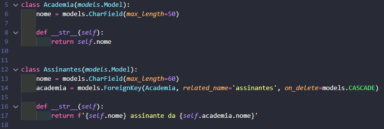

# Otimização de Queries no Django

## Introdução

Este projeto explora práticas de otimização de queries no Django, abordando um problema comum conhecido como N+1 queries. Esse problema pode surgir ao acessar dados relacionados entre modelos em views e templates, o que pode gerar um grande número de queries e impactar o desempenho da aplicação.

## Contexto

Para ilustrar o problema, consideramos uma estrutura de dados envolvendo dois modelos: **Academia** e **Assinante**, onde cada academia pode ter múltiplos assinantes, caracterizando um relacionamento de um-para-muitos. No Django, esse tipo de relação é geralmente implementado com uma chave estrangeira que referencia a academia a qual o assinante pertence.

### Relação do Modelo

Quando exibimos essas informações em um template, o Django pode executar uma nova consulta para cada acesso aos dados relacionados. Por exemplo, ao iterar sobre uma lista de academias e tentar exibir os assinantes de cada uma, o Django fará queries adicionais para cada academia, resultando em um problema de N+1 queries.

## Problema: N+1 Queries

O problema de N+1 queries ocorre quando o Django realiza uma query inicial para buscar todos os objetos principais (neste caso, academias), e, em seguida, executa queries adicionais para buscar os objetos relacionados (os assinantes). Em uma lista com N academias, o Django realizará 1 query para buscar todas as academias e mais N queries para buscar os assinantes de cada academia, totalizando N+1 queries.

Esse comportamento pode ser extremamente ineficiente, especialmente ao lidar com grandes volumes de dados, uma vez que cada query adicional aumenta o tempo de resposta.

## Solução: `prefetch_related`

Para resolver o problema de N+1 queries, utilizamos o método `prefetch_related` do Django. Esse método permite que todos os objetos relacionados sejam pré-carregados em uma única operação, reduzindo o número de queries.

Ao usar `prefetch_related`, o Django executa uma query inicial para buscar todas as academias e uma segunda query para carregar todos os assinantes relacionados. Dessa forma, o número de queries se mantém constante, independentemente da quantidade de academias ou assinantes, melhorando significativamente a performance da aplicação.

## Conclusão

Usar `prefetch_related` é uma prática recomendada para otimizar o desempenho de queries em Django, especialmente em relações de um-para-muitos ou muitos-para-muitos. Esse método reduz a quantidade de queries necessárias para buscar dados relacionados, garantindo uma renderização mais eficiente em templates e um tempo de resposta menor.

---

